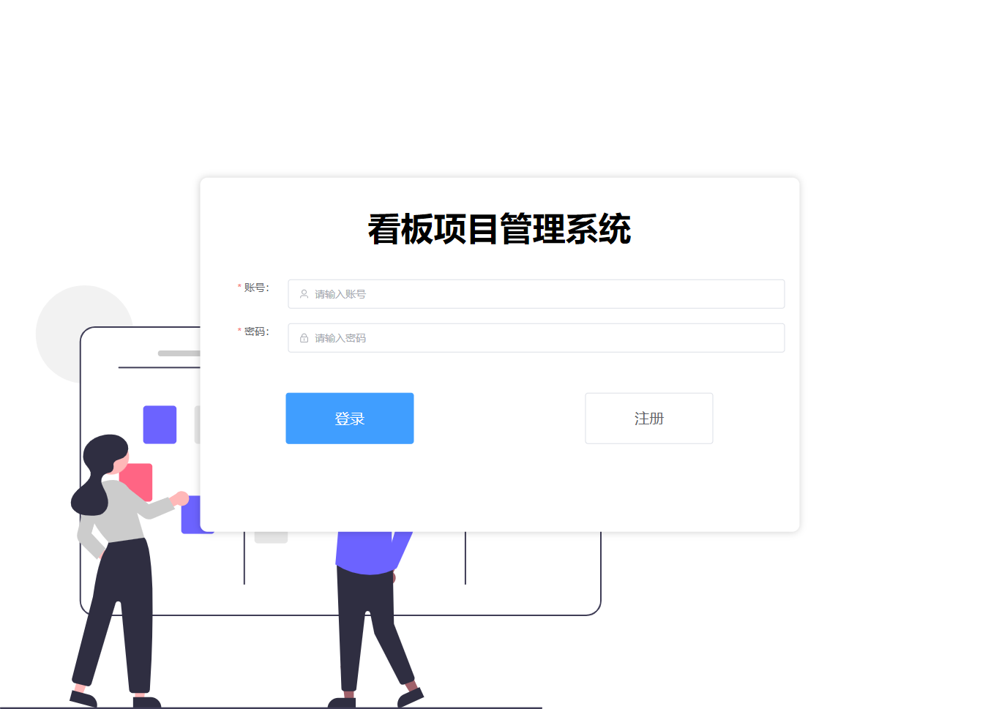
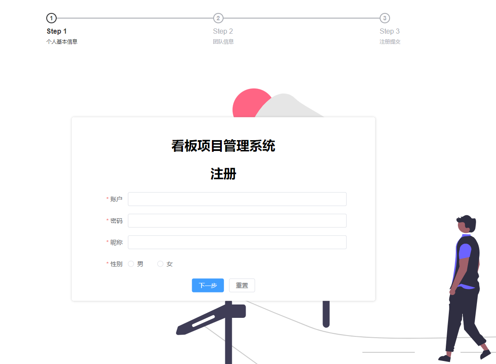
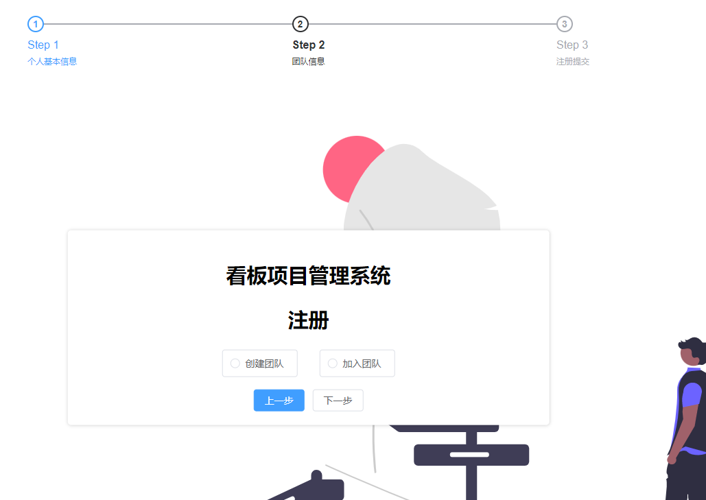
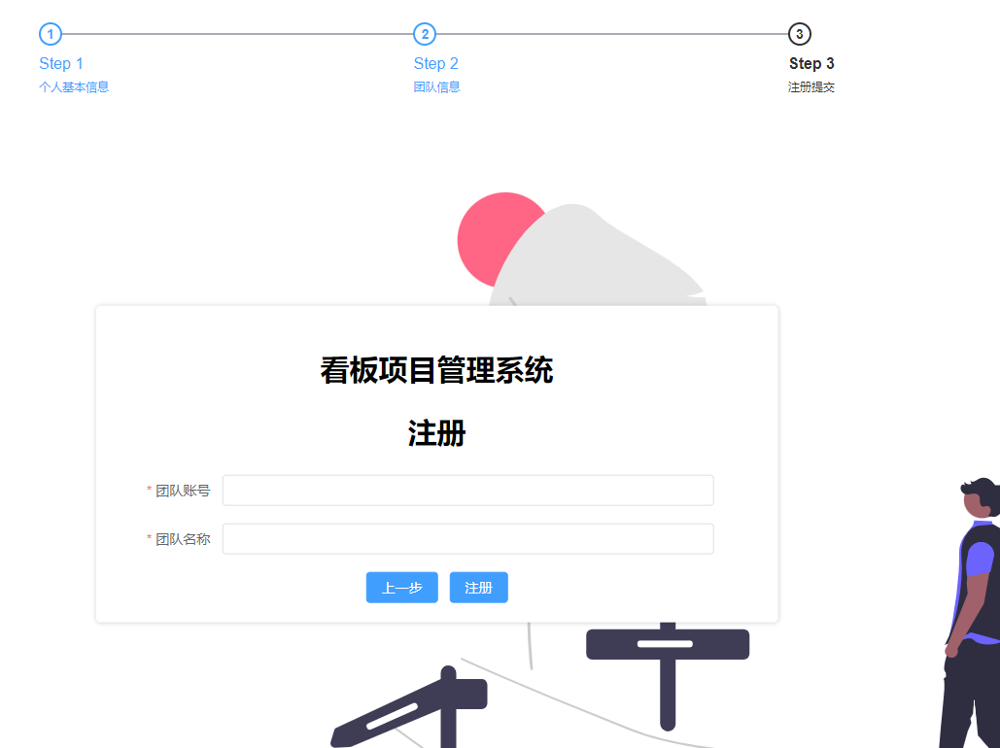
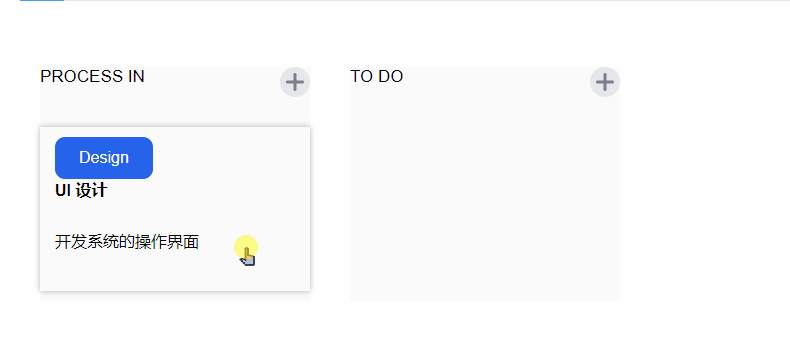
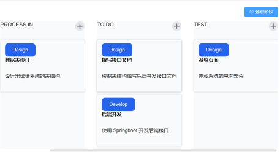
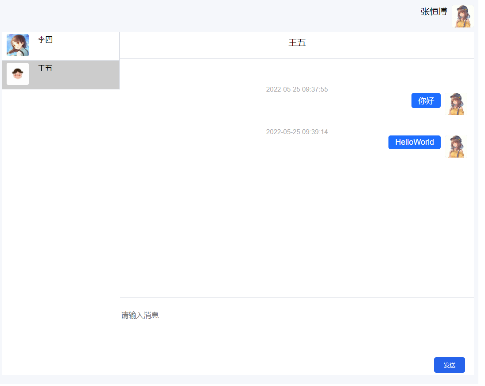
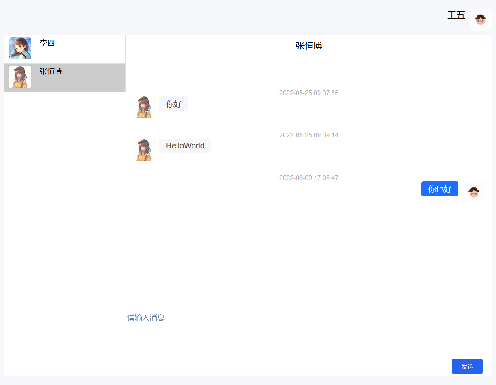
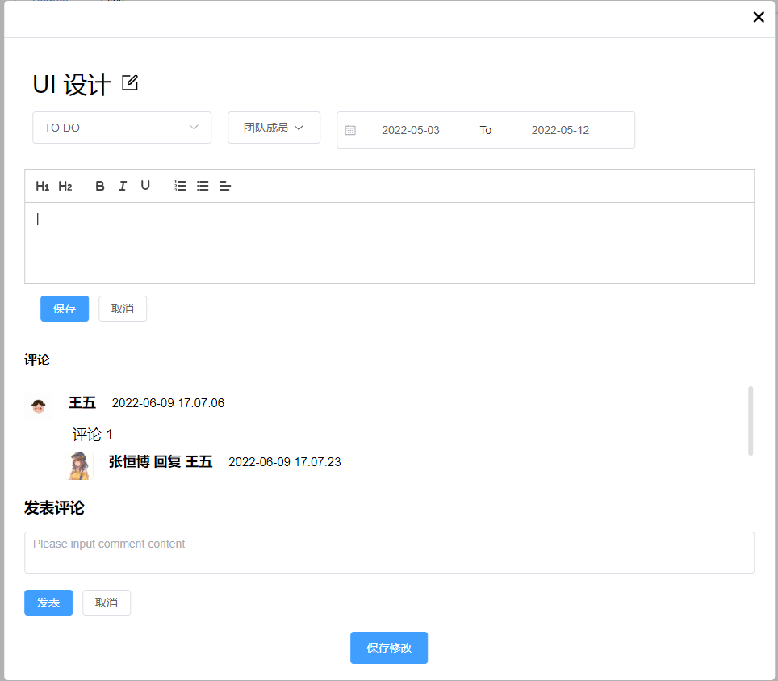
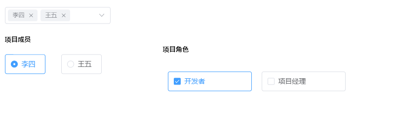

# 基于看板的项目管理系统

## 后端

-   权限 根据角色，分配权限，使用RBAC权限模型
-   聊天 使用websocket实现实时聊天和redis作为聊天记录存储
-   登录使用jwt token认证
-   支持文件上传和下载
-   评论，数据库根据父级id，递归构建json树
-   任务卡片的查看、添加、修改、删除

## 前端

-   Element-Plus 组件库
-   Vue3 前端框架
-   axios http请求库
-   vue-draggable 拖拽组件
-   vue-quill 富文本编辑器

## 效果图

### 登录

### 注册

-   第一步

-   第二步

-   第三步

### 看板

长按鼠标300ms，开始拖拽

### 阶段添加

当阶段数量超过可视宽度，出现横向滚动条

### 聊天

点击联系人，在文本框输入信息，类似qq

### 任务卡片

### 权限分配

